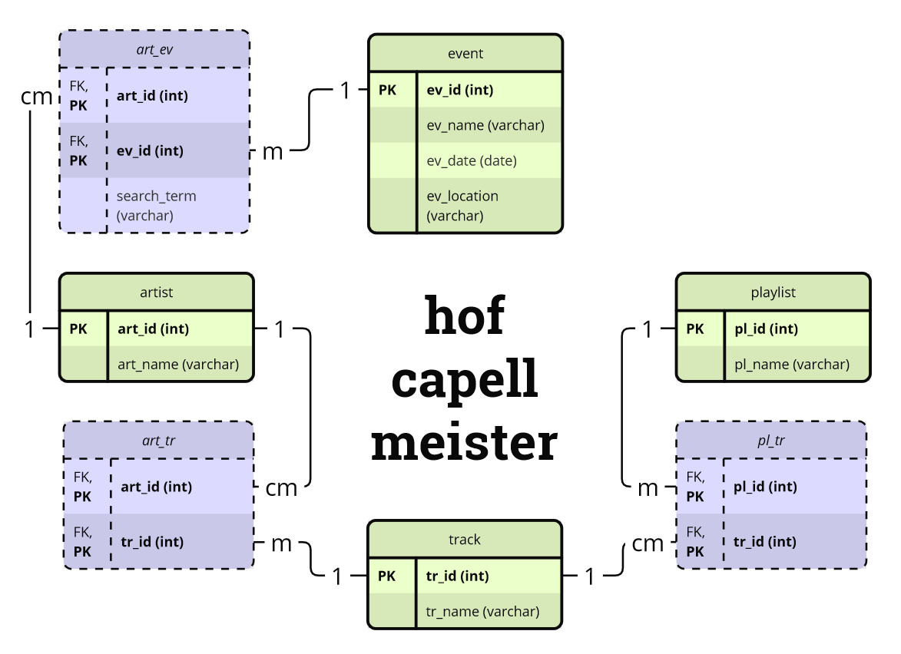

# hofcapellmeister
connects infos from your music streaming habits (Deezer) to concerts of your favourite artists in your area (for Vienna, www.volume.at)

## how to use
### info
#### database structure:


### Set up database
Set up a MariaDB server with your preferred method and create a database.\
Per default, the database is running locally, database name is *hofcapellmeister*, user is *hcm* with password *db_connector*.\
Default values can be changed in the ***hcm.cnf*** file.

Here is one example how you can set up the database, using xampp:
- run xampp
- from the xampp control panel, start Apache, then MySQL
- start a shell from the xampp control panel, then type:
  ```console
  mysql -u root
  ```
- to create the database, type:
  ```mysql
  CREATE DATABASE hofcapellmeister;
  USE hofcapellmeister;
  ```
- to quit (**after** *hofcapellmeister* is finished - it needs a running MariaDB server to work!), type:
  ```mysql
  EXIT;
  ```
If user root has a password, and you don't want to put this password into the cnf file, you can create a user just for access to this database, for example:
- enter MariaDB from command shell:
  ```console
  mysql -u root -p
  ```
- in the MariaDB terminal, type:
  ```mysql
  CREATE DATABASE hofcapellmeister;
  create user 'hcm'@'localhost' identified by 'db_connector';
  grant all on hofcapellmeister.* to hcm@localhost;
  ```
### Set up/run program
- set up docker environment from the main folder of your *hofcapellmeister* repository (after ensuring that Docker is running):
  ```console
  docker build -t hcm .
  ```
- run docker container in interactive mode and mount directory for development (on Windows):\
*NOTE*: You might run into issues if you have any spaces in the path of your working directory. This is a known issue with Docker. Furthermore, the syntax for mounting your working directory might vary slightly, depending on the operating system and/or console you are working from.
  ```console
  docker run -it --rm -v ${PWD}:/hcm hcm bash
  ```
- run docker container in interactive mode and mount directory for development (on Linux):
  ```console
  docker run -it --rm --network="host" -v /${PWD}:/hcm hcm bash

  ```
- ***module api_logger.py***: extract data from playlists via *Deezer API* and save it to csv files in ppl_tr_data and tr_art_data, in subdirectories named by playlist id;\
The playlist IDs from Deezer must be provided via a textfile in the same folder as ***api_logger.py***, containing one ID per line.
  ```console
  python api_logger.py <textfile_with_playlist_ids>
  ```
- ***module web_logger.py***: get previous and future event data via *volume.at webscraping* for a list of artists (directly from database) and save it to csv files in events_data;\
*CAUTION*: Web_logger uses the artist info directly from the database. Therefore, you have to run ***api_logger.py*** AND ***save_data.py*** before you can use ***web_logger.py***!
  ```console
  python web_logger.py
  ```
- ***module save_data.py***: create all tables for database if they don't exist;\
save all data from folders ***events_data***, ***pl_tr_data***, ***tr_art_data*** to the *hofcapellmeister* database;\
*NOTE*: You can (and should) run ***save_data.py*** multiple times: Once after ***api_logger.py*** has run, and again after ***web_logger.py*** also finished.
  ```console
  python save_data.py
  ```
- ***module plot_data.py***: get data for future events and for artists and plot an overview in ***result_plots.png***\
*NOTE*: The data are filtered by number of tracks (how many tracks from this artist are found in the database, assuming that the more tracks of this artist are in your playlist, the more important this artist is to you) to provide a reasonable output with readable plots.
Currently, the filter is set to at least 1 tracks for future events and 1 tracks for the overview of your favorite artists directly in the python script, which works fine for the sample playlist used for development. You will probably have to change these parameters to get reasonable output.
  ```console
  python plot_data.py
  ```
- ***module db_connector.py***: contains a class with all methods for connecting to the database;\
Normally, it is not called directly, but if you want to delete all data from your database, there are two lines at the end of the file you can uncomment and run db_connector directly.
  ```console
  python db_connector.py
  ```
Remember to comment out these two lines again before you use ***save_data.py***, or else you will delete what you previously saved! Of course you can also delete the database and newly create it directly in your database (probably less error-prone).

## ideas for further improvement
- bunch together all scripts in a main.py file, take parameters for plotting from external source (config file for example), change dockerfile to run the complete program instead of development mode
- add webscraping from arena.wien homepage and/or others to complete missing details
- if no events can be found for users favourite artists, get events for recommended/similar artists
- get all playlists and favourite songs from a user (with user login)
- try to implement the project also for other music streaming services 
